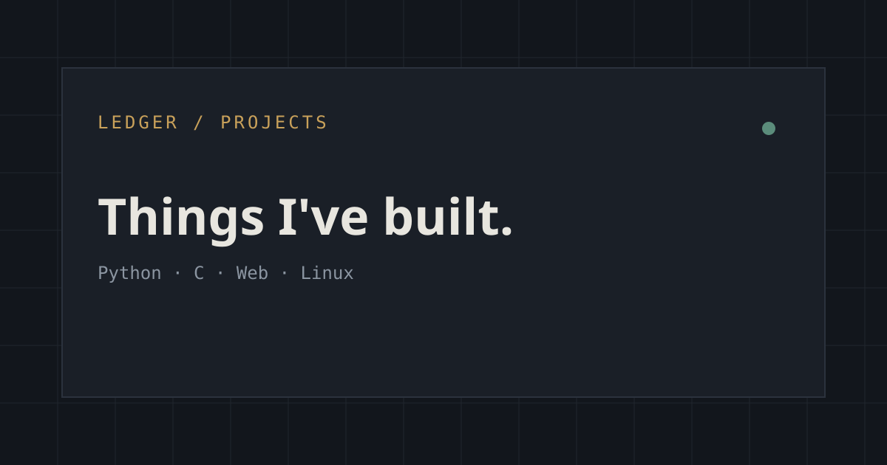

<p align="center">
	
</p>

[](https://tuffgit21.github.io/)
[](https://tuffgit21.github.io/)
[](LICENSE.txt)

A personal portfolio and projects website for Youssef / tuffgit21, built as a lightweight static site using HTML, CSS, and JavaScript.

## Overview

This site showcases:

- project work and case studies
- an about section
- contact links and site navigation
- privacy and terms pages
- a custom 404 page
- branding assets such as the favicon and social preview image

## Demo

The live site is available here:

- https://tuffgit21.github.io/

## Screenshot



## Project structure

- `index.html` — homepage
- `404.html` — custom not-found page
- `styles.css` — site styling and layout
- `site.js` — client-side behavior and page interactions
- `privacy.html` — privacy policy
- `terms.html` — terms page
- `Files.html` — project files listing
- `Ledger-logo.svg`, `favicon.svg`, and related favicon files — branding assets
- `og-image.svg` — social preview image
- `LICENSE.txt` — project license

## Local preview

From the project folder, run:

```bash
python -m http.server 8000
```

Then open:

```text
http://localhost:8000
```

## Deployment

This project is designed to be served as a static website, including GitHub Pages deployment from the repository root.

## Credits

Built and maintained by Youssef / tuffgit21.

## Contact

- GitHub: https://github.com/tuffgit21
- Website: https://tuffgit21.github.io/

## Notes

- The site is intentionally simple and fast.
- Assets are bundled directly in the project folder.
- The design uses a dark, tech-style layout with a custom logo and accent color system.
